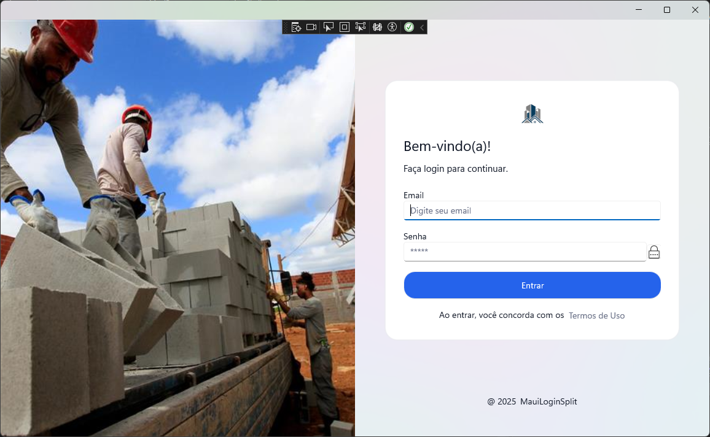

# 🔒 Tela de Login Dividida — .NET MAUI (C#)


---

## 📝 Descrição
Projeto de exemplo em **.NET MAUI** focado na criação de uma tela de login responsiva com um layout de tela dividida (**Split Screen**), ideal para tablets e desktops.

O objetivo é demonstrar o uso de recursos de UI e interatividade básica em aplicações .NET MAUI.

### 🖼️ Preview do Layout


O app contém:
- Um layout dividido em duas colunas (`Grid` com `ColumnDefinitions="*,*"`).
- Um painel de fundo (imagem) em uma coluna.
- O formulário de login na outra coluna.

> Objetivo: Apresentar a estilização via **ResourceDictionary**, manipulação de eventos (Ex: `Clicked`), controle de visibilidade de senha (`IsPassword`) e a leitura de arquivos estáticos (Termos de Uso).

---

## ✨ Principais Recursos
- **Layout de Tela Dividida:** Uso do `Grid` para criar um layout `50/50` ideal para telas maiores.
- **Estilização Global:** Definição de cores e estilos para `Button`, `Label`, `Entry` e `Border` no `ResourceDictionary` (`Styles.xaml`).
- **Toggle de Senha:** Funcionalidade para mostrar/esconder a senha usando `Entry.IsPassword` e um `ImageButton`.
- **Validação Simples:** Validação básica de campos vazios e formato de email/senha mínima.
- **Termos de Uso:** Demonstração de leitura de um arquivo estático (`Termos.txt`) do App Package usando `FileSystem.OpenAppPackageFileAsync`.
- **Componentes MAUI:** Utilização de `Grid`, `VerticalStackLayout`, `Entry`, `Button`, `Image`, etc.

---

## 💻 Pré-requisitos
- **Windows 10/11** ou **macOS**
- **Visual Studio 2022+** com a carga de trabalho **“.NET Multi-platform App UI development (MAUI)”**
- **.NET SDK** compatível com MAUI (Geralmente incluído na instalação do VS)

dotnet workload install maui

## 📥 Como Obter o Projeto

### Opção 1 — Git (recomendado)
```bash
- `git clone https://github.com/seu-usuario/seu-repo.git`
- `cd seu-repo`
```

### Opção 2 — Download
- Baixe o arquivo **.zip** do repositório
- Extraia em uma pasta local
- Abra o arquivo **.sln** no Visual Studio

---

## 🚀 Executando o App
1. Abra a solução no Visual Studio.
2. Selecione o destino (recomendado **Windows Machine** ou **Android Emulator/Dispositivo** para ver o layout dividido).
3. Clique em **Run/Play (F5)**.

---

## 💡 Como Usar a Tela
- **Email:** Digite um email válido (que contenha '@').
- **Senha:** Digite uma senha (mínimo de 4 caracteres para a validação simples).
- **Toggle Senha:** Clique no ícone de olho para mostrar ou esconder a senha.
- **Entrar:** Tenta fazer o login. Se as condições simples forem atendidas, exibirá "Sucesso". Caso contrário, exibirá "Erro".
- **Termos de Uso:** Clicar neste botão exibe o conteúdo de um arquivo de texto estático (`Termos.txt`).

---

## 🏗️ Estrutura de UI e Lógica
Este projeto utiliza a abordagem **Code-Behind** simples para a lógica, em vez do MVVM:

- **View (MainPage.xaml):** Define a estrutura da interface, o layout dividido e todos os componentes (Labels, Entries, Buttons).
- **Code-Behind (MainPage.xaml.cs):** Contém a lógica de tratamento de eventos:
    - `OnTogglePassword`: Altera o `IsPassword` do `Entry` de senha.
    - `OnLoginClicked`: Valida os campos de email e senha e exibe um alerta de sucesso/erro.
    - `OnShowTerms`: Lê e exibe o conteúdo do arquivo `Termos.txt`.
- **Estilos (Styles.xaml):** Um `ResourceDictionary` que define estilos e cores globais para a aplicação.

---

## 📂 Estrutura do Projeto

```text
/MauiLoginSplit
├─ Resources/
│  ├─ Images/
│  │  ├─ eye.png          # Ícone para o Toggle de Senha
│  │  ├─ login_bg.jpg.jpg # Imagem de Fundo do Split Screen
│  │  └─ logo.jpg         # Logo
│  ├─ Raw/
│  │  └─ Termos.txt       # Termos de Uso lidos pela aplicação
│  └─ Styles/
│     └─ Styles.xaml      # Estilos globais da UI
├─ MainPage.xaml          # Interface de Usuário (Layout Split)
└─ MainPage.xaml.cs       # Lógica (Code-Behind) da tela de login
```

---

## 🛣️ Roadmap (Possíveis Melhorias)
- Implementar o padrão **MVVM** (Model-View-ViewModel).
- Criar um **ViewModel** para a lógica de login e estado dos campos.
- Adicionar validação de formulário mais robusta (ex: regex para email).
- Suporte a temas claro/escuro.
- Adicionar animações na transição de estado dos campos.

---

## 🤝 Contribuindo
Sinta-se à vontade para contribuir com melhorias, correções ou novos recursos!

- Faça um Fork do projeto.
- Crie uma branch para sua feature: `git checkout -b feature/minha-melhoria`
- Commit suas alterações: `git commit -m 'feat: Adiciona nova funcionalidade'`
- Envie para o branch original: `git push origin feature/minha-melhoria`
- Crie um Pull Request.

---

📜 **Licença**
Este projeto está sob a licença MIT. Veja o arquivo [LICENSE](LICENSE) para mais detalhes.
